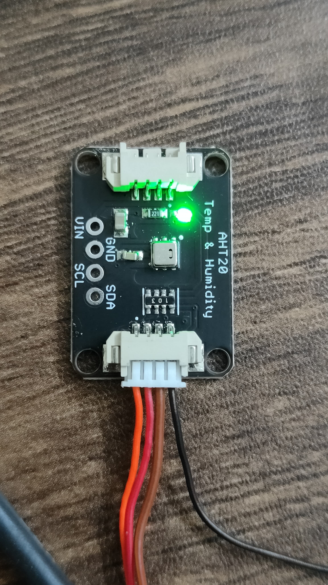
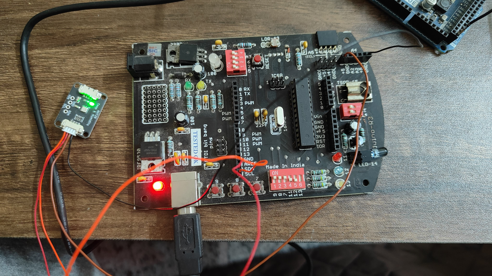
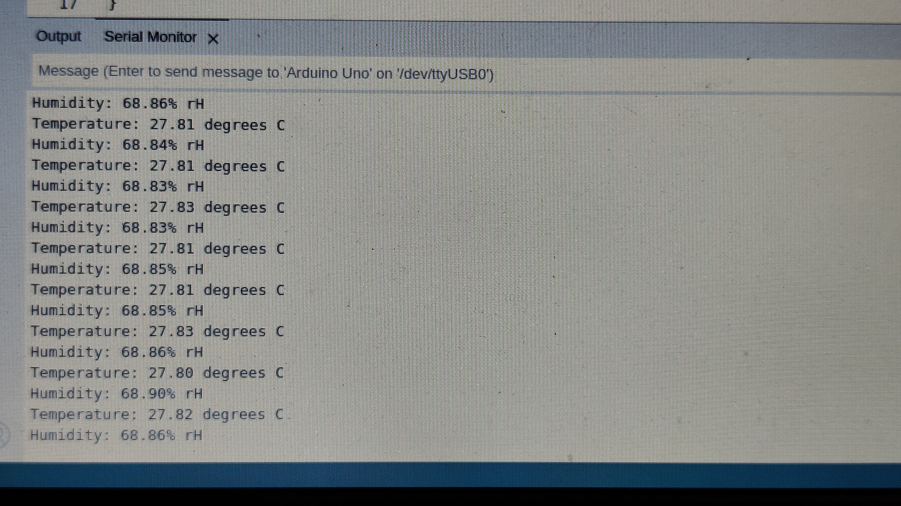

# digital_clock
Arduino based digital clock with temperature and humidity sensor

## Components  

### SmartElex AHT20 Temperature & Humidity Sensor  

Datasheet: [datasheet_smart_elex](docs/datasheets/smartelex-aht20-temperature-humidity-sensor.pdf)  

[AHT20-1](docs/datasheets/Data_Sheet_AHT20-1.pdf)

#### Test setup  

Sensor module  

   

  

Results  

  
